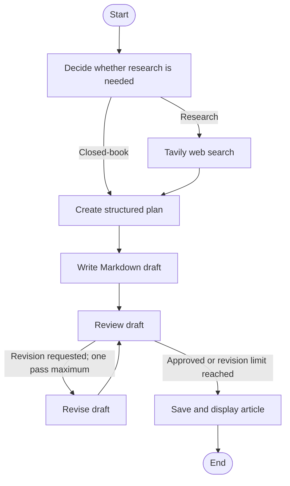

# BlogForge

**BlogForge** is a Streamlit app that uses a stateful LangGraph workflow to plan, draft, review, and optionally revise technical blog posts. It uses Google Gemini for language-model calls and Tavily for optional web research.

> BlogForge is a portfolio prototype. Generated text and its research sources require human review; a reviewer score is not a guarantee of factual accuracy.

## Features

- Chooses between closed-book writing and external research based on the topic.

- Searches Tavily for focused evidence when research is selected.

- Creates a typed blog plan with Pydantic and Gemini structured output.

- Generates a Markdown article, then scores it and may perform one revision.

- Displays workflow progress, selected evidence, the plan, reviewer feedback, and the final article.

- Saves the article as Markdown under `outputs/` and provides a **Download Markdown** button.

- Shows user-facing notices for Gemini quota exhaustion and temporary provider outages.

## Workflow



## Technology

- Python 3.11+

- Streamlit

- LangGraph

- LangChain and `langchain-google-genai`

- Google Gemini API (default model: `gemini-3.7-flash`)

- Tavily Search API

- Pydantic

## Run locally

### 1. Create a virtual environment

Windows PowerShell:

```
py -3.11 -m venv .venv
.\.venv\Scripts\Activate.ps1
```

macOS/Linux:

```bash
python3 -m venv .venv
source .venv/bin/activate
```

### 2. Install dependencies

```bash
python -m pip install --upgrade pip
pip install -r requirements.txt
```

### 3. Configure API keys

Copy the example file and edit `.env`:

```
# Windows PowerShell
Copy-Item .env.example .env
```

```bash
# macOS/Linux
cp .env.example .env
```

Set the values in `.env`:

```
GOOGLE_API_KEY=your_google_ai_studio_api_key
TAVILY_API_KEY=your_tavily_api_key
GEMINI_MODEL=gemini-3.7-flash
```

- Create a Gemini API key in [Google AI Studio](https://aistudio.google.com/apikey).

- Create a Tavily API key in your Tavily account. It is used only when the workflow selects research; provide it to exercise the research branch.

- `GEMINI_MODEL` is optional. If omitted, the app uses `gemini-3.7-flash`. The code also accepts `GEMINI_API_KEY` as an alternative to `GOOGLE_API_KEY`.

### 4. Start the app

```bash
streamlit run app.py
```

Streamlit prints a local URL in the terminal, usually `http://localhost:8501`.

## Project structure

```
.
├── app.py             # Streamlit interface and error messages
├── agents.py          # Gemini-backed research decision, planner, writer, reviewer, reviser
├── pipeline.py        # LangGraph construction, routing, streaming, and output saving
├── schemas.py         # Pydantic models and shared graph state
├── tools.py           # Tavily research and evidence handling
├── requirements.txt   # Python dependencies
├── .env.example       # Local environment-variable template
└── outputs/           # Generated Markdown articles (created when the app runs )
```

## Outputs and research quality

The final article is previewed in the app and saved as a timestamped Markdown file in `outputs/`. The app displays collected source cards separately; it does **not** currently guarantee that the article contains inline citations or that each claim is supported by those sources.

Topics involving current events, emerging technology, health, law, or finance should be checked against authoritative, up-to-date sources before publication. Tavily results can be outdated, off-topic, or low quality. The internal review agent evaluates the draft against its prompt and schema; it is not an independent fact-checker.

## Deployment status

This source snapshot is configured for local environment variables. `agents.py` and `tools.py` load credentials through `os.getenv()` and `python-dotenv`; they do not currently read Streamlit's `st.secrets` directly. Before deploying to Streamlit Community Cloud, update both credential-loading paths to support the deployment's Secrets mechanism, then test the deployed app without committing any API keys.

A public deployment shares the server-side API credentials across visitors. Gemini quotas vary by project and model, and the provider can return quota errors (`429`) or temporary availability errors (`503`). The app explains those failures, but it has no global per-user rate limiter, automatic model fallback, or always-available sample/demo mode yet. Add those controls before relying on a public live demo.

The app writes files to its local `outputs/` directory. Treat that filesystem as temporary when hosted; use the in-app download button to save an article.

## Known limitations

- Generated claims can be unsupported or incorrect, even when the review score is high.

- Research sources are displayed separately rather than attached as citations to individual claims.

- The default Gemini free tier may have restrictive request limits, and service availability is not guaranteed.

- The public app currently has no cross-user quota protection or sample-only fallback mode.

- Automated test files are not included in this repository snapshot.

## Security

**Never commit ****`.env`****, API keys, or other credentials.** If a key is accidentally published, revoke it with its provider and create a replacement. Keep public repository examples limited to placeholders, as in `.env.example`.